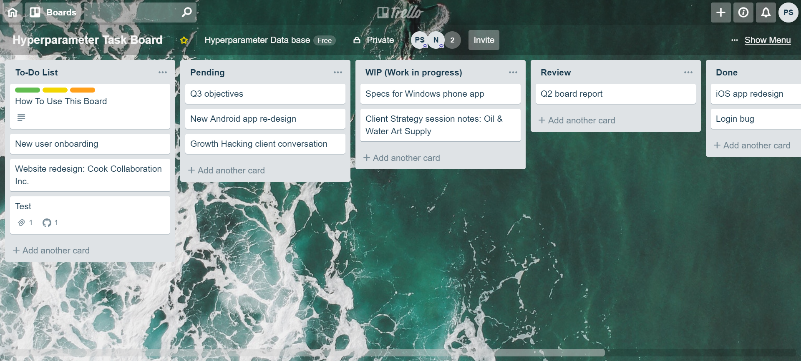

# OnBoarding
The norms and regulations for OnBoarding to Skunkworks

-	Slack Channels
    -	Fatweasel
    -	AI Skunkworks
    -	Hyperparameter.net
-	Work Areas
    -	GitHub
    -	Google Cloud Platform
    -	Trello
-	Roles
    -	Supervisors – Prof. Nik, Ann
    -	Project Managers – Karan, Balaji, Anurag & Anusha, 
•	AutoKaggler in Spark and TF - Statistical Models (Karan)
•	AutoKaggler in Spark and TF - Time Series (Balaji)
•	AutoKaggler in Spark and TF - Deep Learning (Anurag and Anusha)
•	Hyperparameter DB - (Prabu)
•	Jobs DB (Anurag and Anusha)
    -	Onborading/Task managers
    -	Students

## Scenarios

1.	"I want to get involved in a Skunkworks project, what do I do?"

The ONLY projects open to newbies are:

      •	AutoKaggler in Spark and TF - Statistical Models (Karan)
      •	AutoKaggler in Spark and TF - Time Series (Balaji)
      •	AutoKaggler in Spark and TF - Deep Learning (Anurag and Anusha)
      •	Hyperparameter DB - (Prabu)
      •	Jobs DB (Anurag and Anusha)

Other projects require acceptance by the respective project leaders.

* Also, they must showcase some work on Fatweasel as a formal way to enter. They will be called to the Open mic, where they must display their work/idea, irrespective of it being complete/incomplete. Then, the remaining group leaders/Project managers/members of Skunkworks will decide to consider them into the Skunkworks and their work for further analysis.

* Once, they are approved and considered with the work into the Skunkworks, they will be added into AI Skunkworks (Slack) formally as a member (Kindly make sure if the AI Skunkworks sub channels are still private and not public). 

* Then, their project, based on the member’s decision, will be added under hyperparameter.net channel as a subchannel.
Only the Project managers will be Admin to these Subchannels and will decide whom to give access.

* The Subchannels of Projects should be Private/not Public to ensure not anyone can join. Those who join the Slack channel Publicly, should only be able to access #general & #random (This should be made sure).

-----------------------------------------------------------
2.	Once, the Project members add the newbies to their Project – the project managers should assign them the tasks. The project should be maintained at 3 work areas.

      - GitHub – Project repository
      - GCP (Google Cloud Platform) – Project Server
      - Trello – Project tickets system where the Tasks are assigned to the project members and tasks related to the project are completed.
      
* It is the responsibility of the Project Manager, to manage and give the newbie the Knowledge Training (KT) on the project that has been developed till now, stating all the outcomes and scenario and granting them the access to the above work areas and facilitate the working for the Project.
Onboarding members will soon, make the KT videos for the work area setup:

      •	How to I use Google Cloud? 
      •	How to use Slack?
      •	Trello, etc. 
      
and storing it on the GitHub Repo as well as YouTube for serving as a tutorial to set them up.
* The source for these Videos will be in YouTube under the control of skunkworksneu@gmail.com.

------------------------------------------------------
3.	Once the Tasks are decided. Trello is where it will be posted.
 
 
 
* Project Managers and Rui Wang will take the creation and handling the tasks of their respective projects. Rui will be assisting in creating and assisting in avoiding any mal practice by students in handling the tasks.

